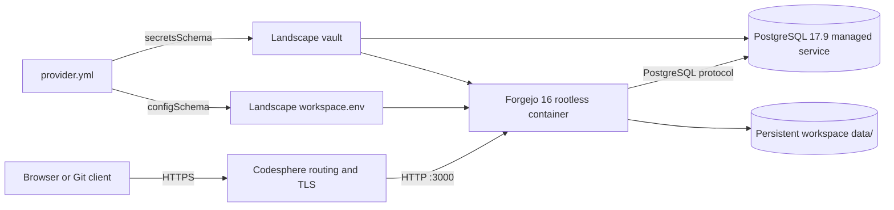

# Git Server architecture

## Overview

Each catalog deployment creates one Codesphere landscape containing an
application container and a PostgreSQL managed service.



## Components and responsibilities

### Managed service provider

`provider.yml` is the catalog contract. It describes the service, validates
user-supplied configuration and secrets, points Codesphere at this landscape
repository, and maps provider version `0.1.0` to the immutable `v0.1.0` Git tag.
Plans are disabled because provider plans do not control landscape resources;
actual resources are selected by the landscape CI profile.

### Forgejo application

`ci.yml` runs the official `codeberg.org/forgejo/forgejo:16-rootless` image as
UID 1501/GID 1010. Codesphere checks `http://localhost:3000/` for health and
routes `/` to port 3000. TLS terminates at the Codesphere edge.

Forgejo's environment-to-INI convention translates variables such as
`FORGEJO__service__DISABLE_REGISTRATION` into settings in `app.ini`. Provider
configuration therefore takes this path:

```text
configSchema -> workspace.env -> ci.yml env -> Forgejo app.ini
```

### PostgreSQL

The landscape asks the `postgres/v1` provider for a dedicated PostgreSQL 17.9
service. Its internal DNS name is derived from the Codesphere team and workspace
IDs. The application password is shared with Forgejo through the vault; the
superuser password is only passed to the database provider.

### Persistent file storage

The workspace-backed `data/` path is mounted at both `/data` and
`/var/lib/gitea`, matching the rootless image's persistent paths. It holds Git
repositories and file-backed Forgejo data. The database separately holds users,
permissions, issues, pull requests, and other relational state.

## Networking and trust boundaries

- Only port 3000 is routed. Forgejo's built-in SSH server is explicitly disabled.
- PostgreSQL is reached over the managed-service internal network and is not
  exposed by this landscape.
- Database credentials enter through the Codesphere vault, not `workspace.env`
  or the Git repository.
- Codesphere owns the external service URL and forwards requests to the
  container after edge TLS termination.
- Registration and anonymous viewing default to disabled to provide a private
  starting posture.

## Scaling and availability

The application is intentionally limited to one replica. Forgejo writes
repositories and other assets to workspace storage, so adding replicas without
shared, concurrency-safe storage could produce inconsistent state. PostgreSQL is
managed independently, but the application remains a single-instance service.

Availability and disaster recovery depend on two coordinated data sets:

1. the PostgreSQL managed-service backup; and
2. the workspace `data/` backup.

They should be captured and restored from a consistent point in time. A future
multi-replica design would need shared object/repository storage, coordinated
sessions and queues, and validation that all Forgejo file stores are safe for
concurrent access.
